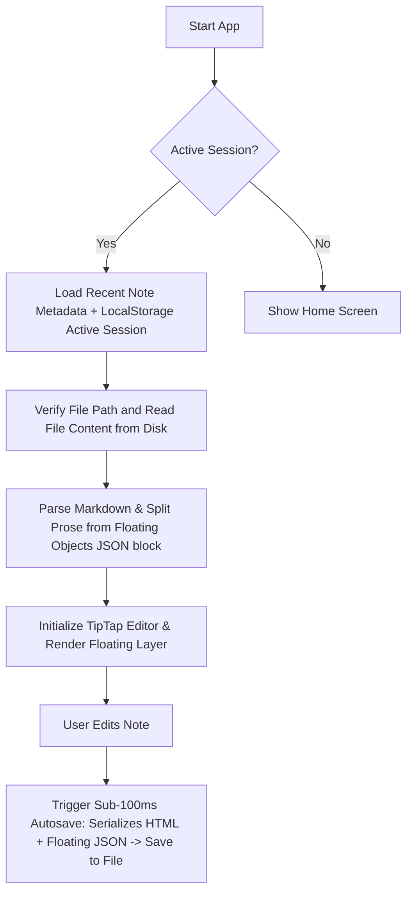

# Project Overview

## Project Purpose
**Study Notes** is a premium, minimalist Windows desktop study notebook and document publisher designed for students, researchers, and writers. It bridges the gap between structured linear rich-text notes and visual, non-linear brainstorming canvases (sticky notes, floating images, text blocks, and connections).

## Target Users
- **Students & Academics**: High-speed, distraction-free study notes with ruled layouts mimicking physical paper.
- **Visual Thinkers**: Users who require mindmap-like diagrams, sticky notes, and drawing/connection tools laid out over their structured writing.
- **Technical Writers**: Note-takers who need native Markdown, LaTeX font rendering support (implied by styled math-friendly fonts), and table operations.

## Main Goals
1. **Physical Notebook Illusion**: Render an edit canvas that feels exactly like ruled/notebook paper with strict vertical alignment to 36px rules.
2. **Infinite Visual Canvas Overlay**: Stacking draggable and resizable images, sticky notes, and text blocks on top of standard prose.
3. **Robust Local Storage & Autosave**: Offline-first performance ensuring zero data loss with sub-100ms automatic background writes directly to local `.md` or `.txt` files.
4. **Pristine Export Pipeline**: Generating high-fidelity PNG images and print-quality PDF files with background grids and overlays preserved.

## Current Version
- **Version**: 1.0.0
- **Release Status**: Development / Pre-production Desktop App.

## Architecture Overview
The application follows a **Multi-Layer Stacking Architecture** inside a hybrid Electron desktop process structure:
- **Main Process (`electron/main.js`)**: Exposes native desktop file system APIs, system dialogs, process singleton checking, application config files, and standard window management events.
- **Preload Script (`electron/preload.js`)**: Sandboxes access to the main process via `contextBridge.exposeInMainWorld`, exposing a restricted `window.electronAPI` bridge.
- **Renderer Process (React 19 + Vite)**: Renders the frontend layout and controls note state.
  - **Layer 1 (Bottom, z-index 10)**: SVG rendering layer containing outline connection paths, chevrons, debug grids, and drawing strokes.
  - **Layer 2 (Middle, z-index 20)**: Tiptap rich-text editor canvas aligning exactly with the `36px` ruled lines.
  - **Layer 3 (Top, z-index 30)**: Floating canvas objects overlay containing draggable sticky notes, images, text cards, and connect handles.

## Technology Stack
| Tech Group | Libraries / Tooling | Purpose |
|---|---|---|
| **Core Framework** | React 19.2.8, Vite 8.2.0 | Reactive component rendering and high-speed Hot-Module-Replacement compilation. |
| **Desktop Shell** | Electron 43.2.0, Electron Builder 26.0.0 | Native OS window encapsulation and NSIS installer compilation. |
| **Editor Engine** | TipTap 3.29.2, ProseMirror | Extensible ProseMirror-based rich text edit engine. |
| **Metadata Parsing** | Marked 18.0.7, Turndown 7.2.4 | Bidirectional parsing between HTML editor state and disk-based Markdown. |
| **Graphics & Utilities**| `@xyflow/react`, `lucide-react`, `html2canvas`, `jspdf` | Flow path generation, vector icons, canvas cloning, and PDF generation. |

## High-Level Workflow

